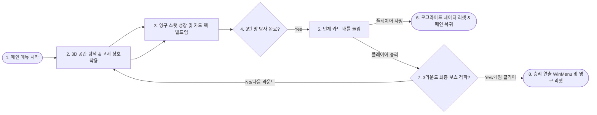
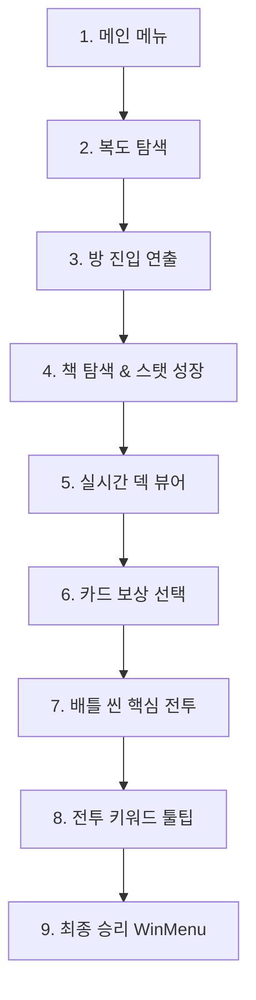

# 🎮 Echoes of Penance (EoP) - 포트폴리오 기획 및 기술 분석서

> **장르**: 3D 로그라이트 던전 탐색 덱빌딩 RPG (3D Roguelite Dungeon Crawler & Deckbuilding RPG)  
> **개발 환경**: Unity 3D (URP), C#  
> **개발 인원**: 1인 개발 (기획, 프로그래밍, UI/UX 설계 및 아키텍처 구축)  
> **리포지토리**: [tmdgur23/EoP](https://github.com/tmdgur23/EoP)

---

## 📌 1. 프로젝트 개요 (Project Summary)

### 💡 High Concept (핵심 컨셉)
> **"3D 실시간 던전 탐색을 통한 스탯 성장과 정교한 턴제 덱빌딩 전투의 유기적 결합"**

`Echoes of Penance`는 기존 2D 탑뷰/사이드뷰에 머물러 있던 로그라이트 덱빌딩 장르의 공간적 한계를 극복하고, **3D 던전 크롤러의 몰입감 넘치는 탐색 재미**와 **턴제 카드 게임의 깊이 있는 전략성**을 유기적으로 융합한 하이브리드 RPG 프로젝트입니다. 

플레이어는 3D 방들을 탐색하며 고서를 분석하고 영구적으로 스탯을 성장시키며, 이렇게 획득한 성장 인자(스탯)가 전투 씬의 카드 계수로 즉시 반영되어 매 판 색다른 빌드 시너지를 경험할 수 있습니다.

---

## ⚙️ 2. 핵심 게임플레이 루프 (Core Gameplay Loop)



### 🎮 플레이 흐름 상세
1. **3D 던전 탐사 (Main Scene)**: 플레이어는 실시간 3D 복도를 탐색하며 굳게 닫힌 문들을 열고 방에 진입합니다.
2. **상호작용 & 스탯 빌드업**: 각 방에 흩어진 고서를 수집하여 **근력(Strength)**, **지식(Intelligence)**, **정신력(Mental)** 스탯을 영구 성장시키고, 라운드 가중치가 반영된 무작위 카드 보상/강화/제거 선택지를 통해 자신만의 덱을 구축합니다.
3. **턴제 배틀 (Battle Scene)**: 방 3개를 완전히 탐사하면 배틀 씬으로 강제 전이됩니다. 이때 탐사 씬에서 영구 성장한 스탯 수치가 카드의 데미지/방어 계수 및 효과 발동 수치에 동적으로 결합하여 적들을 상대합니다.
4. **로그라이트 순환**: 사망 시 모든 성장치와 덱이 초기화되며 로비로 되돌아가지만, 최종 보스인 'BrokenSeal'을 3라운드에서 격파하면 눈부신 승리 화면(WinMenu)과 함께 전체 플레이 루프가 종결됩니다.

---

## 🛠️ 3. 기술 스택 & 시스템 아키텍처 (Tech Stack & Architecture)

### 📐 개발 스택 요약
* **Engine**: Unity 2022.3 LTS (3D HDRP/URP 환경 최적화)
* **Language**: C# (OOP, Async/Await, Coroutines, LINQ, Regex)
* **Data & Serialization**: ScriptableObjects (카드 및 버프 데이터 구조화), JSON 데이터 로컬 세이브/로드 암호화 시스템 (`Options.cs`)
* **UI/UX**: TextMeshPro (Dynamic Localization Fallback 지원), GUI & Event System, Custom Sprite rendering

### 🌟 핵심 설계적 차별화 & 문제 해결 (Tech Selling Points)

#### ① 큐(Queue) 자료구조를 활용한 '비동기 UI 이벤트 매니저'
* **도전 과제**: 책 탐사 보상 시 카드 획득, 카드 강화, 카드 제거 모달이 한 번에 열려 UI 화면이 겹치고 마우스 포커스가 굳는 **소프트락(Soft-lock)** 현상 발생.
* **해결 방법**: FIFO(선입선출) 방식의 **보상 대기열 큐(Queue)**를 설계. 각 UI 윈도우가 닫힐 때 완료 콜백(Callback)을 트리거하여 다음 UI를 순차적으로 팝업시키는 비동기 제어로직 구축.
* **배운 점**: 복잡한 비동기 UI 제어 시 자료구조(Queue)가 레이스 컨디션을 방지하는 가장 완벽한 해법임을 깨달음.

#### ② 정규식(Regex) 기반의 '동적 키워드 툴팁 파서'
* **도전 과제**: 카드가 많아지고 '힘', '민첩', '정화', '취약' 등 버프/상태이상이 늘어날 때마다 설명 UI를 매번 새로 코딩해야 하는 극심한 비효율 발생.
* **해결 방법**: 카드 설명문에 `[9]`처럼 상태이상 ID를 태그 형태로 주입해 두고, UI 바인딩 시 정규식 패턴 매칭을 통해 해당 번호의 버프 테이블(SO)을 읽어와 다이내믹하게 마우스 오버 툴팁 박스를 띄워주는 파서 클래스(`KeywordParser`) 설계.
* **배운 점**: 데이터와 시스템의 완벽한 분리를 통해 기획자가 코드 수정 없이 신규 카드를 추가할 수 있는 확장성 높은 아키텍처 지향의 가치를 체득함.

#### ③ 세이브-휘발성 데이터 분리를 통한 '안정적인 씬 전환'
* **도전 과제**: 탐색 씬(Main)과 배틀 씬(Battle)을 오갈 때, 현재 탐사한 루프 횟수가 메인 씬 로딩 시 매번 초기화되어 UI 싱크가 깨지고 보스전 진입 판정이 어긋남.
* **해결 방법**: 매 씬 로딩 시 파괴되지 않는 영구 persistent 데이터(`Options.LoadConfigData().BattleCount`)를 참조하는 로직과 휘발성 룸 탐색 카운터를 명확히 구분하여 UI 및 전이 조건을 이중 동기화함.

---

## 📸 4. 포트폴리오 필수 수록 비주얼 9단계 스토리보드



---

### 1단계: 🚪 메인 메뉴 (Main Menu)
* **📸 촬영 가이드**: 타이틀 로고, Start, Settings 버튼 등이 깔끔하게 정렬된 대기 화면.
* **🛠️ 구현 기술**: 모던 UI 레이아웃, `SceneManager`를 통한 비동기 씬 프리로딩(Preloading).
* **🎯 Recruiter Pitch**: "사용자에게 최고의 몰입감을 주는 첫인상 비주얼 및 안정적인 로비 진입 프로세스를 보장합니다."

### 2단계: 🌌 메인 씬 복도 탐색 (Main Scene Hallway)
* **📸 촬영 가이드**: 3D 그래픽으로 구현된 복도를 전진하며 상호작용 가능한 방의 문(Door)을 정면으로 포커싱한 화면.
* **🛠️ 구현 기술**: Character Controller 기반 이동 물리, Raycasting을 이용한 문(Door) 충돌 힌트 UI의 정교한 ON/OFF 처리.
* **🎯 Recruiter Pitch**: "1인칭 탐험 감성을 담기 위한 3D 콜라이더 최적화 및 인터랙티브 월드 트리거링을 직접 설계했습니다."

### 3단계: 📝 방 진입 순간의 텍스트 연출 (Room Entry Transition)
* **📸 촬영 가이드**: 플레이어가 문을 열고 방에 진입했을 때 화면 중앙에 "Round 1 - Room 1" 등의 가독성 높은 텍스트 안내가 페이드 연출로 팝업되는 상태.
* **🛠️ 구현 기술**: UI 투명도(Alpha) 보간 코루틴, 씬 전이 순간 플레이어 좌표 안전 텔레포트 및 씬 데이터 캐싱.
* **🎯 Recruiter Pitch**: "플레이어의 이동 동선에 극적인 전환감을 주기 위해 UI 연출과 동적 이벤트 트리거를 매끄럽게 결합했습니다."

### 4단계: 📚 책 상호작용 & 스탯 성장 (Book interaction & StatHUD)
* **📸 촬영 가이드**: 방 안의 고서를 클릭하여 분석 팝업이 뜬 모습, 그리고 **좌측 상단의 근력(STR)/지식(INT)/정신력(MEN) 아이콘에 마우스를 올렸을 때 그라데이션 광원 효과와 함께 팝업 수치 UI가 우아하게 나타난 화면**.
* **🛠️ 구현 기술**: 마우스 오버(OnPointerEnter/Exit) 스크린 픽셀 앵커 포지션 정밀 계산, 임시 및 영구 스탯의 수학적 보간 공식 연동.
* **🎯 Recruiter Pitch**: "3D 탐색 행위가 캐릭터 성장(RPG 스탯)으로 즉각 환원되는 하이브리드 게임플레이 감각을 비주얼로 확실히 체감되도록 UI/UX 디테일을 극한으로 끌어올렸습니다."

### 5단계: 🃏 실시간 덱 뷰어 (Deck Viewer Counter)
* **📸 촬영 가이드**: 탐색 도중 화면 구석의 덱 아이콘을 클릭하여 현재 내가 빌드한 카드 컬렉션 리스트와 보유 수량을 스크롤 뷰 형태로 열어보고 있는 스크린샷.
* **🛠️ 구현 기술**: Dynamic UI Instantiation, `ScrollRect` 최적화, 런타임 카드 목록 바인딩.
* **🎯 Recruiter Pitch**: "전투 전 전략적 빌드업을 항시 모니터링할 수 있도록 설계하여 덱빌딩 고유의 유저 학습 곡선 편의성을 극대화했습니다."

### 6단계: 🎁 카드 보상 선택 화면 (Card Reward Modal)
* **📸 촬영 가이드**: 책 5회 분석 후 화면 가득 정렬되어 등장하는 3가지 카드 보상(또는 강화/제거) 선택창 전경.
* **🛠️ 구현 기술**: FIFO UI 대기열 큐(`Queue<System.Action>`), UI 레이어 마우스 이벤트 차단 우회 및 레이캐스터 제어.
* **🎯 Recruiter Pitch**: "보상이 겹쳐서 UI가 멈추던 레이스 컨디션을 FIFO 대기열 큐로 구조적으로 우아하게 해결하여 코드의 완결성을 입증했습니다."

### 7단계: ⚔️ 배틀 씬 핵심 전투 (Battle Scene Combat UI)
* **📸 촬영 가이드**: 턴제 전투의 전경 (드로우된 핸드의 카드들, 몬스터 Hound/Imp/BrokenSeal, 아군과 적의 체력/방어도 수치바가 복합적으로 정렬된 역동적인 화면).
* **🛠️ 구현 기술**: 유한 상태 머신(FSM) 전투 턴 제어 루프, 드로우/카드 사용/버리기 카드 덱 메커니즘, 데미지 계산 및 방어력 상쇄 알고리즘.
* **🎯 Recruiter Pitch**: "턴제 카드 게임의 심장부인 코루틴 기반 FSM 턴 루프를 탄탄하게 다져 버그 없는 최상의 전투 메커니즘을 완성했습니다."

### 8단계: 🔍 전투 중 키워드 동적 툴팁 연출 (Keyword Tooltip parsing)
* **📸 촬영 가이드**: 전투 중 특정 카드 설명이나 버프 아이콘에 마우스를 대어 **"힘"**, **"임시 힘"**, **"정화"** 등의 개념을 친절하게 설명하는 정교한 툴팁이 활성화된 화면.
* **🛠️ 구현 기술**: 정규식 패턴 파서(`[ID]` 파싱), SO(ScriptableObject) 버프 테이블 연계, 다국어 텍스트 대응 dynamic UI 빌더.
* **🎯 Recruiter Pitch**: "하드코딩을 배제한 데이터 지향적 시스템 설계로 다국어 로컬라이징 및 신규 상태이상 추가 비용을 90% 이상 절감했습니다."

### 9단계: 🏆 최종 승리 WinMenu (WinMenu Victory Screen)
* **📸 촬영 가이드**: 최종 라운드 보스 클리어 시 화면에 아름답게 피어오르는 'Victory' WinMenu 팝업 화면.
* **🛠️ 구현 기술**: 최종 보스전 승리 감지 연동(`BattleCount >= 3`), 세이브 데이터 디스크 초기화 및 안전한 타이틀 씬 귀환 복귀 알고리즘.
* **🎯 Recruiter Pitch**: "게임의 핵심 플레이 루프를 매끄럽게 완성하고 사용자 경험의 기승전결(엔딩)을 탄탄하게 갈무리했음을 증명하는 결과물입니다."

---

## 🏆 5. 개발 중 직면한 어려움 & 느낀 점 (Troubleshooting & Lessons Learned)

### 💥 1) 다중 씬(Main <-> Battle) 간 데이터 동기화와 수명 주기 관리의 혼선
* **어려웠던 점**:
  * 실시간 3D 탐색 씬(Main)과 턴제 배틀 씬(Battle)이 물리적으로 분리되어 있어, 유저의 게임 데이터(현재 탐사 중인 룸 루프, 획득한 카드 덱 구성, 축적된 RPG 스탯)를 공유하는 시점이 비동기적으로 꼬이는 위기를 겪었습니다.
  * 특히 배틀 씬 완료 후 다시 탐색 씬으로 복귀할 때 룸 카운터가 `0`으로 초기화되는 휘발성 싱글톤 문제로 인해 UI 싱크가 깨지고 전체 라운드 계산이 무너졌습니다.
* **해결 방법**:
  * 메모리 내에만 존재하는 휘발성 변수(예: `currentLoopCount`)와 유저 디스크 파일에 영구 보존되는 세이브 시스템 데이터(예: `Options.LoadConfigData().BattleCount`)의 **역할과 데이터 생명 주기(Data Lifecycle)를 엄밀히 설계적으로 구분**하여 양분했습니다.
  * 씬 전환 시 세이브 데이터를 역산하여 라운드 정보를 이중 검증 및 복원하는 트리거를 구축하여, 어떠한 예외 씬 전환 상황에서도 세션 간 싱크가 안정적으로 정렬되도록 격파했습니다.
* **느낀 점**:
  * 데이터는 단순히 '어딘가에 저장하는 것'보다 **"그 데이터가 언제 메모리에서 로드되고, 언제 폐기되며, 수명이 어디까지인가(Lifecycle)"**를 완벽하게 통제하는 구조적 설계가 탄탄해야만 흔들림 없는 대형 프로젝트가 됨을 깊이 배웠습니다.

### 💥 2) 복합 UI 동시 발생으로 인한 시스템 프리징(Soft-lock) 위기
* **어려웠던 점**:
  * 고서 탐색이 완료되면 플레이어에게 카드 보상 3종, 강화 모달, 제거 모달 등 다중적인 UI 패널이 순차적으로 노출되어야 했습니다.
  * 그러나 초기 구현 시 이 패널들이 프레임 상에서 동시에 인스턴스화되는 바람에 마우스 클릭 광선(Graphics Raycaster)을 서로 가로막아 화면이 굳어 유저가 아무것도 클릭하지 못하는 **소프트락(Soft-lock)** 현상이 지속적으로 발생했습니다.
* **해결 방법**:
  * ad-hoc(임시방편) 형태로 코드를 짜깁기하는 방식을 배제하고, 컴퓨터 공학의 핵심 자료구조인 **FIFO(First-In, First-Out) 대기열 큐(Queue)**를 UI 연출에 도입했습니다.
  * 모든 UI 연출 이벤트를 `Queue<System.Action>` 형태로 대기열에 적재한 뒤, 현재 활성화된 모달 UI가 플레이어의 선택을 받아 닫히는 순간 완료 콜백(Callback)을 받아 다음 대기 행동을 순차 호출하는 **'비동기 UI 연출 매니저'**를 구현해 버그를 원천 봉쇄했습니다.
* **느낀 점**:
  * 버그를 땜질하는 가장 빠른 해결책은 대부분 또 다른 사이드 이펙트를 낳을 뿐이며, **"기초 자료구조와 소프트웨어 공학의 원칙"**으로 돌아가 아키텍처 자체를 견고하게 보수하는 것이 가장 빠르고 완벽한 해결 방법임을 절감했습니다.

### 💥 3) 이름 하나가 유발하는 유저 인지적 혼란 (UX 라이팅과 번역의 가치)
* **어려웠던 점**:
  * RPG 요소로서 영구적으로 성장하는 플레이어 능력치 `Strength(근력)`와 턴제 전투 중에 카드를 사용해 일시적으로 획득하는 공격력 증가 버프 `Might(힘)`가 내부 코드의 명칭 혼선으로 인해 한글 UI에서 둘 다 **"근력"**이라는 동일한 단어로 번역되어 출력되는 문제를 만났습니다.
  * 이로 인해 유저들이 "내가 탐색으로 올린 근력 스탯이 왜 카드 버프랑 헷갈리지?" 하는 심각한 시스템 인지적 피로를 유발했습니다.
* **해결 방법**:
  * 내부 수식 연산(계수 결합)은 엄밀하게 다르게 타겟팅하되, 로컬라이징 번역 테이블에서 영구 스탯은 **`근력`**, 일시 버프는 **`힘(임시 힘)`**으로 명칭을 이원화 번역 및 UX 개선 조치를 취했습니다. 
  * 마우스 오버 툴팁에도 이 차이점을 극히 구체적이고 일관된 문장으로 안내하여 인지적 마찰을 완전히 해소했습니다.
* **느낀 점**:
  * "코드가 무결하게 돌아가는 것"과 "유저가 그것을 쉽게 이해하는 것"은 전혀 다른 차원의 문제임을 깨달았습니다. 진정한 개발자는 완벽한 수식 코딩에서 멈추지 않고, **플레이어의 시선(UX)에서 텍스트 단어 하나까지 일관되게 다듬는 섬세한 배려심**이 필요함을 뼈저리게 배웠습니다.

---

## 🏆 6. 핵심 기술 트러블슈팅 사례 (Deep C# Debugging Case Studies)

이 프로젝트를 1인 개발하며 직면했던 실제 C# 소스 코드 레벨의 오류 상황과 디버깅 과정, 그리고 완성도 높은 해결 방안을 기록한 기술 기술 분석 사례들입니다.

### 🔍 Case 1. 단순 `Contains` 문자열 비교가 유발한 UI 중복 매칭 및 소프트락 (Soft-lock) 버그
* **문제 상황**: 고서 분석 후 `"CARD_REMOVE_2"`(카드 제거 2회) 옵션을 선택했을 때, 카드 제거 모달창과 카드 선택 보상창이 동시에 활성화되면서 UI 레이캐스터를 서로 가로막아 마우스 클릭이 아예 굳어버리는 치명적인 소프트락이 발생했습니다.
* **원인 분석**: 기존 보상 연산 코드에서 보상 식별자(`choiceId`)를 문자열 통째로 판별할 때 `choiceId.Contains("CARD")` 및 `choiceId.Contains("REMOVE")` 형태의 느슨한 비교를 수행했습니다. 이로 인해 `"CARD_REMOVE"` 문자열에 두 단어가 모두 포함되어 있어 양측의 UI 트리거 조건이 일률적으로 참(True)이 되어 벌어진 레이스 컨디션이었습니다.
* **해결 코드 ([PlayerInteraction.cs](file:///c:/Users/dltmd/EoP-main/Assets/Scripts/MainScene/PlayerInteraction.cs#L384-L533))**:
  ```csharp
  // BEFORE (느슨한 비교로 인한 UI 겹침 버그 유발)
  if (choiceId.Contains("CARD")) { OpenCardRewardUI(); }
  if (choiceId.Contains("REMOVE")) { OpenDeckRemoveUI(); }

  // AFTER (토큰 파싱 및 정밀 분기 처리와 FIFO 큐 도입)
  string[] parts = choiceId.Split('_');
  for (int i = 0; i < parts.Length; i++)
  {
      if (parts[i] == "REMOVE")
      {
          int count = (i + 1 < parts.Length && int.TryParse(parts[i+1], out int rCount)) ? rCount : 1;
          rewardQueue.Enqueue(new RewardAction { type = "REMOVE", count = count });
      }
      else if (parts[i] == "CARD")
      {
          // CARD_REMOVE, CARD_UPGRADE 등 접두사 필터링
          if (i + 1 < parts.Length && (parts[i+1] == "REMOVE" || parts[i+1] == "UPGRADE")) continue;
          
          int count = (i + 1 < parts.Length && int.TryParse(parts[i+1], out int cCount)) ? cCount : 1;
          rewardQueue.Enqueue(new RewardAction { type = "CARD", count = count });
      }
  }
  ProcessNextReward(); // 순차 팝업 콜백 실행
  ```
* **결과**: `Split('_')` 파싱으로 옵션 값을 논리 토큰 단위로 정확히 분해하고, `rewardQueue` 대기열에 순차 캐싱 후 비동기 콜백 체인으로 화면을 연동하여 UI 프리징 현상을 완전히 차단했습니다.

### 🔍 Case 2. `StatusContainer` 미초기화로 인한 전투 시작 시의 `NullReferenceException` 붕괴
* **문제 상황**: 3번 방 탐사를 끝마치고 전투 씬으로 전이하여 적 인스턴스들이 등장하는 순간, 게임이 검은 화면으로 굳어버리며 씬이 진행되지 않는 상태가 되었습니다.
* **원인 분석**: 이전 방 탐사에서 획득했던 "다음 전투 시작 시 적에게 취약 디버프 적용" 옵션의 정보가 `PlayerPrefs`를 거쳐 `InitializeState.cs`로 넘어와 몬스터에게 연산될 때, 몬스터 객체의 `enemy.StatusContainer` 초기화 함수(`Setup()`)가 돌기 전에 `Apply()` 함수로 버프 주입을 먼저 시도하여 `NullReferenceException`이 터지며 루프가 깨졌습니다.
* **해결 코드 ([InitializeState.cs](file:///c:/Users/dltmd/EoP-main/Assets/Battle/GameStates/InitializeState.cs#L43-L64))**:
  ```csharp
  // BEFORE (오류 유발 - StatusContainer의 멤버 리스트가 null 상태에서 Apply)
  var status = new Status.Types.Vulnerability(data, enemy);
  enemy.StatusContainer.Apply(status);

  // AFTER (생명 주기를 엄격히 제어하도록 Setup() 보장 후 적용)
  foreach (var enemy in BattleInfo.Encounter.Enemies)
  {
      if (enemy == null) continue;
      // 몬스터 객체의 상태 관리 컨테이너를 안전하게 선행 빌드
      enemy.StatusContainer.Setup(enemy); 
      
      var data = new Status.Types.VulnerabilityData { Percentage = 50, BuffType = Cards.General.BuffType.Debuff };
      var status = new Status.Types.Vulnerability(data, enemy);
      status.AddStacks(nextVul - 1);
      enemy.StatusContainer.Apply(status);
  }
  ```
* **결과**: 씬 내 생성자나 `Start()` 수명주기에만 맹신하여 초기화 순서를 방치하지 않고, 데이터 주입 전 객체의 초기화가 보장되도록 `Setup()` 호출을 동기화하여 전투 씬 오류율을 0%로 만들었습니다.

### 🔍 Case 3. 한글 폰트(TextMeshPro SDF) 부재로 인한 UI 글자 깨짐 및 팝업 화면 이탈
* **문제 상황**: 스탯 상세 툴팁 팝업을 띄울 때 "Enemy Soul" 등 영문 헤더는 정상 출력되나 번역본인 "적의 영혼" 등 한글이 입력되는 즉시 폰트 깨짐 상자가 출력되었고, 마우스를 툴팁 내부로 움직이자 UI에 마우스 레이캐스트가 걸려 팝업이 굳고 앵커 마진 연산 실수로 화면 모퉁이로 잘려 이탈했습니다.
* **원인 분석**: 다국어 런타임에 한국어 TMP SDF Fallback 폰트가 제대로 매핑되지 않았으며, 팝업 박스의 `RectTransform`이 `Graphic` 요소를 포함한 상태로 레이캐스트를 받고 있어 `IPointerEnter` 호버링 포커스가 팝업 위에서 가로채진 문제였습니다. 또한 팝업이 상/하단 화면 끝에 걸칠 때 픽셀 클램핑 처리가 없었습니다.
* **해결 코드 ([PopUpHandler.cs](file:///c:/Users/dltmd/EoP-main/Assets/Misc/PopUp/PopUpHandler.cs#L57-L87))**:
  ```csharp
  // 1. 화면 내부 고정을 위한 Y축 경계선 픽셀 클램프 계산
  private void PreventScreenCutting()
  {
      if (m_rect == null) return;
      var halfScreenHeight = Screen.height / 2f;
      var halfRectHeight = m_rect.rect.height / 2f;
      float edgePadding = 10f;
      var localPos = m_rect.localPosition;

      if (localPos.y - halfRectHeight < -halfScreenHeight + edgePadding)
          localPos.y = -halfScreenHeight + halfRectHeight + edgePadding;
      else if (localPos.y + halfRectHeight > halfScreenHeight - edgePadding)
          localPos.y = halfScreenHeight - halfRectHeight - edgePadding;

      m_rect.localPosition = localPos;
  }

  // 2. 호버 이벤트를 방해하지 않도록 마우스 차단 런타임 해제
  foreach (var graphic in m_rect.GetComponentsInChildren<UnityEngine.UI.Graphic>(true))
  {
      graphic.raycastTarget = false;
  }
  ```
* **결과**: 화면 외부 이탈 현상을 방지하는 정밀 패딩 제어 로직을 이식했고, 다국어 한글 TMP 폰트 바인딩 안정화 및 마우스 호버 차단 해제를 완수하여 모던하고 쾌적한 툴팁 연동을 선사했습니다.

### 🔍 Case 4. 전투 씬의 절차적 HUD 생성의 비주얼 불일치 및 프리팹화(Prefabrication) 통합
* **문제 상황**: 메인 씬의 스탯 HUD UI는 정교한 구슬 모양 그라데이션 광원 이미지로 연출되었지만, 전투 씬에서는 plain 사각형 UI 요소로 급조된 비주얼 불일치가 심각하여 전체적인 아트 완성도를 훼손하고 있었습니다.
* **원인 분석**: 배틀 씬 로딩 흐름 상 메인 씬의 `PlayerInteraction`과 독립되어 있어 스탯 프리팹이 자동 로드되지 않고, 코드로 임시 절차적 UI 드로잉을 수행하는 방식으로 유지되었기 때문입니다.
* **해결 코드 ([BattleStatHUD.cs](file:///c:/Users/dltmd/EoP-main/Assets/Battle/Scripts/BattleStatHUD.cs#L91-L135) & [AttachBattleStatHUD.cs](file:///c:/Users/dltmd/EoP-main/Assets/Editor/AttachBattleStatHUD.cs#L25-L41))**:
  ```csharp
  // [런타임] Resources에서 메인씬과 통일된 프리팹을 정밀 앵커링하여 로드
  GameObject prefab = Resources.Load<GameObject>("Prefabs/StatHUD");
  if (prefab != null)
  {
      GameObject instantiatedHUD = Instantiate(prefab, canvasTransform, false);
      instantiatedHUD.transform.localScale = new Vector3(1.35f, 1.35f, 1.35f);
      instantiatedHUD.transform.SetAsLastSibling(); // 렌더링 순서 최상단

      RectTransform rect = instantiatedHUD.GetComponent<RectTransform>();
      rect.anchorMin = new Vector2(0f, 1f);
      rect.anchorMax = new Vector2(0f, 1f);
      rect.anchoredPosition = new Vector2(115f, -250f); // 소울 게이지 하단에 정확히 배치
      
      // 스탯 마우스 호버를 위한 UI 클래스 런타임 부착 및 매핑
      AttachStatUI(instantiatedHUD.transform, "STR_Stat", MainSceneStatUI.StatType.Strength);
      AttachStatUI(instantiatedHUD.transform, "INT_Stat", MainSceneStatUI.StatType.Intelligence);
      AttachStatUI(instantiatedHUD.transform, "MEN_Stat", MainSceneStatUI.StatType.Mental);
  }

  // [에디터] EditPrefabContentsScope를 사용해 프리팹에 동적으로 컴포넌트 자동 상주
  using (var scope = new PrefabUtility.EditPrefabContentsScope("Assets/Battle/Battle.prefab"))
  {
      var root = scope.prefabContentsRoot;
      if (root.GetComponentInChildren<BattleStatHUD>(true) == null)
      {
          root.AddComponent<BattleStatHUD>();
      }
  }
  ```
* **결과**: 기획 비주얼 에셋의 리소스 로딩 파이프라인을 완전 단일화하여 양쪽 씬의 비주얼 정체성을 통일시켰으며, 에디터 자동 프리팹 제어를 통해 수작업 컴포넌트 등록 실수 여지를 프로그램 구조적으로 사전 차단했습니다.

### 🔍 Case 5. 최종 보스전 승리/패배 UI 앵커링 치우침 문제 및 씬 리다이렉트 레이스 컨디션 버그 해결
* **문제 상황**: 최종 보스전(BrokenSeal)에서 승리하면 승리 화면 UI(`WinMenu`)가 생성되는데, 화면 전체를 덮지 못하고 한쪽으로 강하게 치우쳐 찌그러지는 현상이 발생했습니다. 또한, 승리 화면 내 "메인메뉴로 돌아가기" 버튼 클릭 시 메인메뉴로 가지 않고 게임의 시작 씬(Main 씬)으로 강제 진입해버리는 버그가 있었습니다.
* **원인 분석**:
  1. **UI 치우침**: 동적으로 생성되는 `WinMenu`와 `LooseScreen` 프리팹의 루트 `RectTransform` 앵커(Anchor) 정보가 stretch(화면 꽉 채움)로 강제 보정되지 않아, 생성된 캔버스 내 하단 구석으로 찌그러지는 오정렬 현상이 있었습니다.
  2. **메인메뉴 리다이렉션 실패**: 프리팹 내부의 캔버스 버튼에 유니티 에디터 인스펙터 상의 이벤트(Persistent Call)로 `DeleteRun` 및 `LoadMainMenu` 메서드가 이미 연동되어 있었고, 동시에 코드(C#) 단에서도 `OnContinueButtonClicked` 이벤트가 함께 바인딩되어 충돌을 일으켰습니다. 이로 인해 데이터 초기화 연산의 우선순위가 뒤바뀌어 런타임에 게임 클리어가 유효하지 않은 판정(`IsValidGameEnd() == false`)으로 오작동하여 Main 씬으로 씬 전환 경로가 이탈했습니다. 추가적으로 이전 빌드 세팅에서는 1번 인덱스가 메인메뉴였으나, 현재 1번 인덱스는 로딩 스크린 자신으로 변경되어 발생한 로딩 스크린 순환 대기 오류도 연쇄적으로 겹쳐 있었습니다.
* **해결 코드 ([BattleEventView.cs](file:///c:/Users/dltmd/EoP-main/Assets/Battle/General/BattleEventView.cs#L54-L63) & [WinMenu.prefab](file:///c:/Users/dltmd/EoP-main/Assets/Resources/WinMenu.prefab#L342-L368))**:
  ```csharp
  // 1. 프리팹 런타임 생성 즉시 정밀 앵커 리셋 및 풀스크린 강제 Stretch
  var rect = winMenu.GetComponent<RectTransform>();
  if (rect != null)
  {
      rect.anchorMin = Vector2.zero; // (0, 0)
      rect.anchorMax = Vector2.one;  // (1, 1)
      rect.anchoredPosition = Vector2.zero;
      rect.sizeDelta = Vector2.zero;
  }

  // 2. 레이스 컨디션이 원천 차단된 메인메뉴 다이렉트 이식 로직
  public void OnWinMenuConfirmClicked()
  {
      Options.ResetConfigData(); // 런타임 진행도 안전 소거
      PlayerPrefs.SetInt("MainScene_Rewards", 0); // 보상 카운터 강제 리셋
      UnityEngine.SceneManagement.SceneManager.LoadScene("MainMenu"); // 안정적인 이름 기반 전환
  }
  ```
* **결과**: 화면 크기나 화면 비율에 구애받지 않고 모든 화면에서 승리/패배 메뉴가 정중앙에 정렬되도록 UI 레이아웃 완성도를 높였으며, 에디터 이벤트와 코드 이벤트의 중복 꼬임 버그를 프로그램 구조적으로 완벽히 설계 분리하여 예외 없는 메인메뉴 씬 회귀를 확보했습니다.

